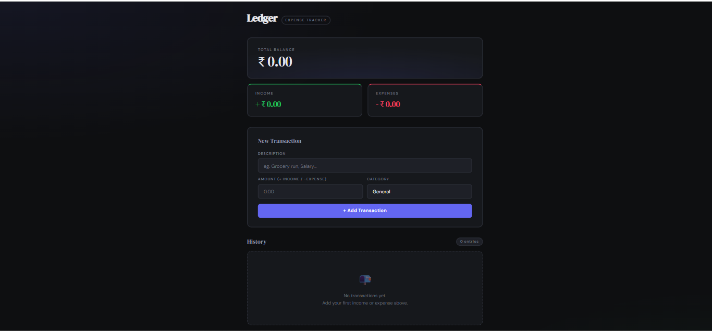
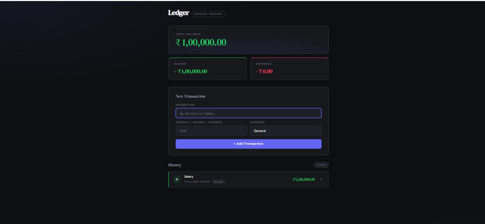
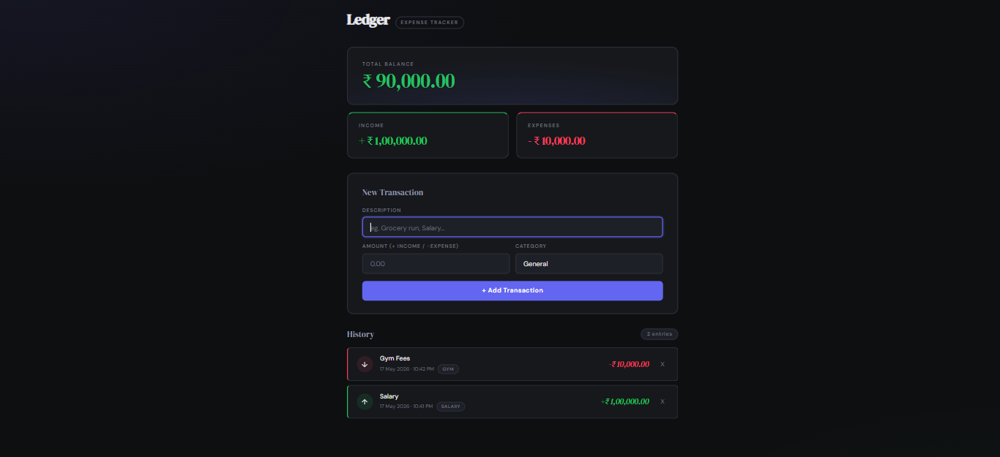

# Ledger — Expense Tracker

A modern and responsive Expense Tracker web application built using vanilla JavaScript, HTML, and CSS.

Track your income and expenses, monitor your balance in real time, and store transactions locally in the browser using `localStorage`.

---

## 🌐 Live Demo

https://expense-tracker-your-vercel-link.vercel.app

---

## 📸 Preview





---

## 🚀 Features

- ➕ Add income and expense transactions
- 🗑️ Delete transactions with smooth animations
- 💰 Real-time balance calculation
- 📊 Income and expense summaries
- 📅 Formatted transaction dates using Day.js
- 💾 Persistent data storage using `localStorage`
- 📱 Fully responsive design
- ⚡ Fast and lightweight
- 🎨 Clean modern UI

---

## 🛠️ Built With

- HTML5
- CSS3
- JavaScript (ES6+)
- Day.js

---

## 📂 Project Structure

```bash
📦 expense-tracker
 ┣ 📂 screenshots
 ┃ ┗ 📸 expense-tracker-SS1.png
 ┣ 📜 index.html
 ┣ 📜 expense-tracker.css
 ┣ 📜 expense-tracker.js
 ┗ 📜 README.md
```

---

## ⚙️ How It Works

The application:

1. Takes user transaction input
2. Stores transactions as JavaScript objects
3. Saves data in browser `localStorage`
4. Dynamically updates:
   - Total Balance
   - Total Income
   - Total Expenses
   - Transaction History
5. Automatically reloads saved transactions on refresh

---

## 🧠 JavaScript Concepts Used

This project helped practice:

- DOM Manipulation
- Event Listeners
- Arrays & Objects
- `map()`, `filter()`, `reduce()`
- Template Literals
- Local Storage
- Form Validation
- Dynamic Rendering
- Conditional Styling
- Date Formatting
- ES6 Features

---

## 🧪 Testing

Tested for:

- Transaction creation
- Transaction deletion
- Input validation
- Local storage persistence
- Responsive layout
- Keyboard interaction
- UI animations

---

## ▶️ Run Locally

Clone the project:

```bash
git clone https://github.com/itzbalajix/expense-tracker.git
```

Go to the project directory:

```bash
cd expense-tracker
```

Run using VS Code Live Server  
or simply open:

```bash
index.html
```

---

## 🔧 Future Improvements

- Edit transactions
- Search & filter
- Charts & analytics
- Monthly reports
- Dark/Light mode toggle
- Export transactions to CSV

---

## 📚 What I Learned

Through this project, I improved my understanding of:

- Building dynamic web applications with vanilla JavaScript
- Managing application state
- Persisting data in the browser
- Structuring clean UI components
- Debugging real-world JavaScript issues

---

## 👨‍💻 Author

Balaji  
MCA Student & Aspiring Full-Stack Developer from India

GitHub: https://github.com/itzbalajix

---

## ⭐ Support

If you liked this project:

- Star the repository
- Fork the project
- Share feedback

---

## 📄 License

This project is open source and available under the MIT License.
